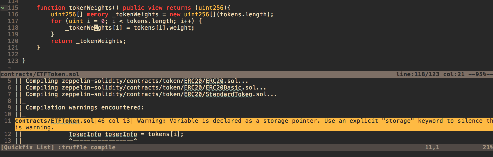

# Solidity Compiler Plugin

## Dependencies
This plugin uses the `truffle compile` command, so you must have [Truffle](https://github.com/trufflesuite/truffle) installed.

## Installation
### Vundle
    Plugin 'dmdque/solidity.vim'

## Usage
Type `:make` from a `.sol` file.
